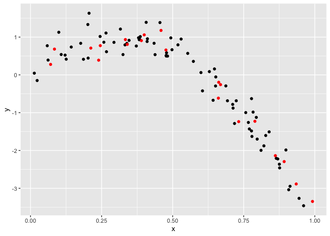
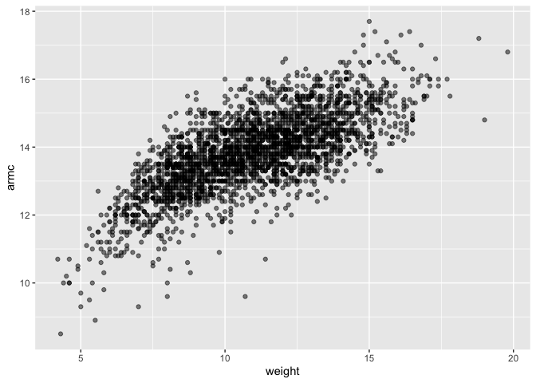
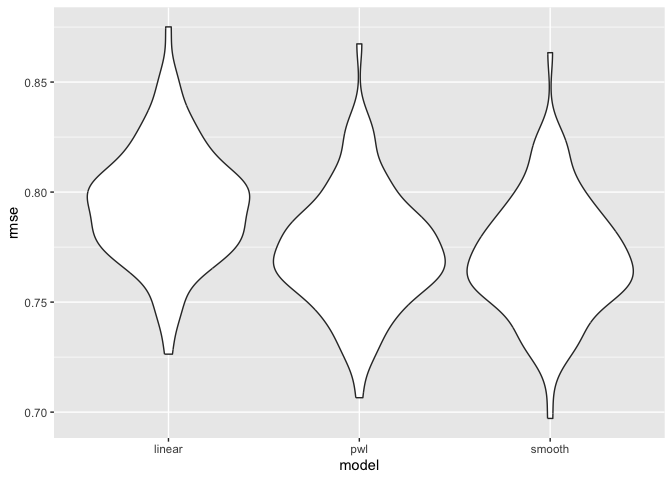

Cross Validation
================
Diana Hernandez
2023-11-14

Load libraries and set seed for reproducibility.

``` r
library(tidyverse)
```

    ## ── Attaching core tidyverse packages ──────────────────────── tidyverse 2.0.0 ──
    ## ✔ dplyr     1.1.3     ✔ readr     2.1.4
    ## ✔ forcats   1.0.0     ✔ stringr   1.5.0
    ## ✔ ggplot2   3.4.3     ✔ tibble    3.2.1
    ## ✔ lubridate 1.9.2     ✔ tidyr     1.3.0
    ## ✔ purrr     1.0.2     
    ## ── Conflicts ────────────────────────────────────────── tidyverse_conflicts() ──
    ## ✖ dplyr::filter() masks stats::filter()
    ## ✖ dplyr::lag()    masks stats::lag()
    ## ℹ Use the conflicted package (<http://conflicted.r-lib.org/>) to force all conflicts to become errors

``` r
library(modelr)
library(mgcv)
```

    ## Loading required package: nlme
    ## 
    ## Attaching package: 'nlme'
    ## 
    ## The following object is masked from 'package:dplyr':
    ## 
    ##     collapse
    ## 
    ## This is mgcv 1.9-0. For overview type 'help("mgcv-package")'.

``` r
set.seed(1)
```

# Nonlinear data and CV

``` r
nonlin_df = 
  tibble(
    id = 1:100,
    x = runif(100, 0, 1),
    y = 1 - 10 * (x - .3) ^ 2 + rnorm(100, 0, .3)
  )

nonlin_df |> 
  ggplot(aes(x = x, y = y)) + 
  geom_point()
```

<!-- -->

Do the train / test split.

``` r
train_df = sample_n(nonlin_df, 80)
test_df = anti_join(nonlin_df, train_df, by = "id")

ggplot(train_df, aes(x = x, y = y)) + 
  geom_point() + 
  geom_point(data = test_df, color = "red")
```

<!-- -->

Models

``` r
linear_model = lm(y ~ x, data = train_df)
smooth_model = mgcv::gam(y ~ s(x), data = train_df)
wiggly_model = mgcv::gam(y ~ s(x, k = 30), sp = 10e-6, data = train_df)
```

Quick visualization!

``` r
train_df |> 
  modelr::add_predictions(smooth_model) |> 
  ggplot(aes(x = x, y = y)) + 
  geom_point() + 
  geom_line(aes(y = pred))
```

<!-- -->

``` r
train_df |> 
  modelr::add_predictions(wiggly_model) |> 
  ggplot(aes(x = x, y = y)) + geom_point() + 
  geom_line(aes(y = pred), color = "red")
```

<!-- -->

Root mean squared errors (RMSEs) for each model.

``` r
rmse(linear_model, train_df)
```

    ## [1] 0.7178747

``` r
rmse(smooth_model, train_df)
```

    ## [1] 0.2874834

``` r
rmse(wiggly_model, train_df)
```

    ## [1] 0.2498309

``` r
rmse(linear_model, test_df)
```

    ## [1] 0.7052956

``` r
rmse(smooth_model, test_df)
```

    ## [1] 0.2221774

``` r
rmse(wiggly_model, test_df)
```

    ## [1] 0.289051

# CV using `modelr`

``` r
cv_df = 
  crossv_mc(nonlin_df, 100) |> 
  mutate(
    train = map(train, as_tibble),
    test = map(test, as_tibble))
```

Apply each model to all training

``` r
cv_results =
  cv_df |>
  mutate(
    linear_fit = map(train, \(df) lm(y ~ x, data = df)),
    smooth_fit = map(train, \(df) mgcv::gam(y ~ s(x), data = df)),
    wiggly_fit = map(train, \(df) gam(y ~ s(x, k = 30), sp = 10e-6, data = df))
  ) |>
  mutate(
    rmse_linear = map2_dbl(linear_fit, test, \(mod, df) rmse(mod, df)),
    rmse_smooth = map2_dbl(smooth_fit, test, \(mod, df) rmse(mod, df)),
    rmse_wiggly = map2_dbl(wiggly_fit, test, \(mod, df) rmse(mod, df))
  )
```

Plot!

``` r
cv_results |> 
  select(starts_with("rmse")) |> 
  pivot_longer(
    everything(),
    names_to = "model", 
    values_to = "rmse",
    names_prefix = "rmse_") |> 
  mutate(model = fct_inorder(model)) |> 
  ggplot(aes(x = model, y = rmse)) + geom_violin()
```

<!-- -->

# Example: Child Growth

``` r
child_growth = read_csv("./data/nepalese_children.csv")
```

    ## Rows: 2705 Columns: 5
    ## ── Column specification ────────────────────────────────────────────────────────
    ## Delimiter: ","
    ## dbl (5): age, sex, weight, height, armc
    ## 
    ## ℹ Use `spec()` to retrieve the full column specification for this data.
    ## ℹ Specify the column types or set `show_col_types = FALSE` to quiet this message.

``` r
child_growth |> 
  ggplot(aes(x = weight, y = armc)) + 
  geom_point(alpha = .5)
```

<!-- -->

``` r
child_growth =
  child_growth |> 
  mutate(weight_cp = (weight > 7) * (weight - 7))
```

Models

``` r
linear_mod = lm(armc ~ weight, data = child_growth)
pwl_mod    = lm(armc ~ weight + weight_cp, data = child_growth)
smooth_mod = gam(armc ~ s(weight), data = child_growth)
```

``` r
child_growth |> 
  gather_predictions(linear_mod, pwl_mod, smooth_mod) |> 
  mutate(model = fct_inorder(model)) |> 
  ggplot(aes(x = weight, y = armc)) + 
  geom_point(alpha = .5) +
  geom_line(aes(y = pred), color = "red") + 
  facet_grid(~model)
```

<!-- -->

``` r
cv_df =
  crossv_mc(child_growth, 100) |> 
  mutate(
    train = map(train, as_tibble),
    test = map(test, as_tibble))
```

Apply models and evaluate

``` r
cv_df = 
  cv_df |> 
  mutate(
    linear_mod  = map(train, ~lm(armc ~ weight, data = .x)),
    pwl_mod     = map(train, ~lm(armc ~ weight + weight_cp, data = .x)),
    smooth_mod  = map(train, ~gam(armc ~ s(weight), data = as_tibble(.x)))) |> 
  mutate(
    rmse_linear = map2_dbl(linear_mod, test, ~rmse(model = .x, data = .y)),
    rmse_pwl    = map2_dbl(pwl_mod, test, ~rmse(model = .x, data = .y)),
    rmse_smooth = map2_dbl(smooth_mod, test, ~rmse(model = .x, data = .y)))
```

Plot!

``` r
cv_df |> 
  select(starts_with("rmse")) |> 
  pivot_longer(
    everything(),
    names_to = "model", 
    values_to = "rmse",
    names_prefix = "rmse_") |> 
  mutate(model = fct_inorder(model)) |> 
  ggplot(aes(x = model, y = rmse)) + geom_violin()
```

<!-- -->
